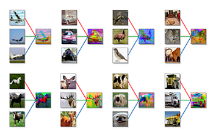
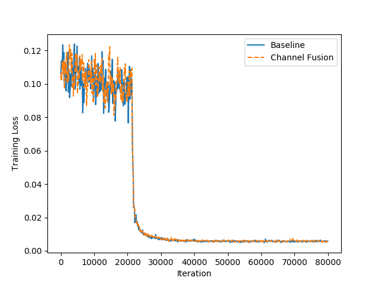
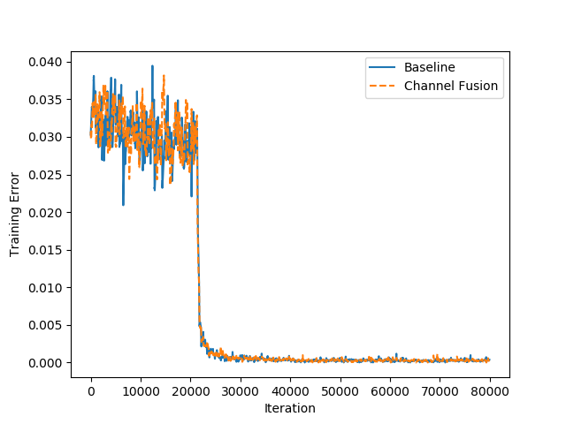
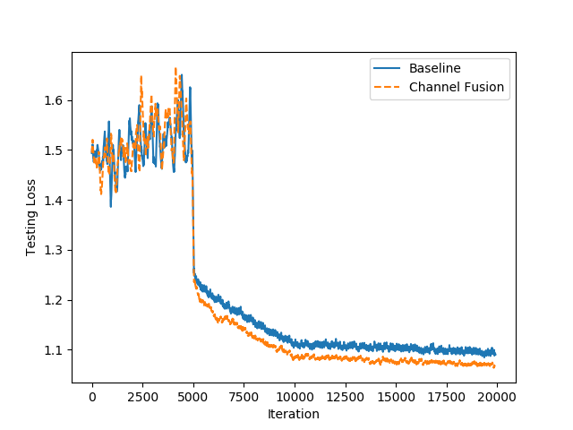
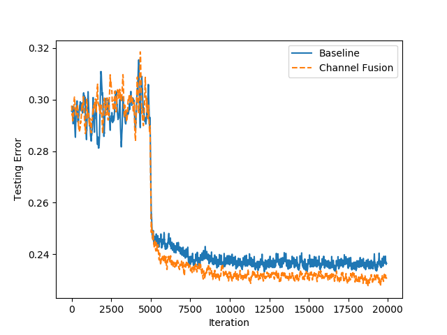

# Channel Fusion: An Effective Data Augmentation to Boost Image Classification
The author's officially PyTorch Channel-Fusion implementation.

The code of models is modified from [`kuangliu/pytorch-cifar`](https://github.com/kuangliu/pytorch-cifar),  have the following modifications:

1. Support `svhn` dataset;
2. `num_classes` can be passed as a parameter;

- *Thanks for the brilliant code of various models!* :smile:

## Channel Fusion

Channel fusion is a surprisingly easy but effective data augmentation approach for models that only needs regrouping different image channels of the same class.

## Requirements

- Python 3.6
- PyTorch 1.0

## Run

1. Dataset preparation, to see [`data/README.md`](https://github.com/wtupc96/channel-fusion/tree/master/data);
2. Train with `python main.py --model [MODEL] --dataset [DATASET] (--channel_fusion) --lr [INIT_LR]`
   - Available models:
     - **VGG**: VGG-11, VGG-13, VGG-16, VGG-19;
     - **ResNet**: ResNet-18, ResNet-34, ResNet-50, ResNet-101, ResNet-152;
     - **ResNet-PreAct**: ResNet-18-PreAct, ResNet-34-PreAct, ResNet-50-PreAct, ResNet-101-PreAct, ResNet-152-PreAct;
     - **LeNet**, **GoogLeNet**;
     - **DenseNet**: DenseNet-121, DenseNet-161, DenseNet-169, DenseNet-201;
     - **ResNeXt**: ResNeXt29_2x64d, ResNeXt29_4x64d, ResNeXt29_8x64d, ResNeXt29_32x4d;
     - **MobileNet**, **MobileNet-V2**;
     - **DPN**: DPN-26, DPN-92;
     - **ShuffleNet**: ShuffleNetG2, ShuffleNetG3, ShuffleNetV2;
     - **SE-ResNet-18**;
     - **EfficientNet-B0**.
   - Available datasets:
     - CIFAR-10;
     - CIFAR-100;
     - SVHN.
3. You will see results on the console and get checkpoints as well as losses and accuracies in `checkpoint` folder. :)

## Results

ResNet-18-PreAct:

|  |  |
| :-------------------------: | :--------------------------: |
|        Training Loss        |        Training Error        |
|   |   |
|        Testing Loss         |        Testing Error         |

